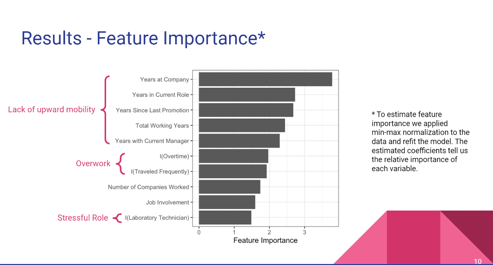

# Employee Attrition Prediction Project

This project uses synthetic data from [Kaggle](https://www.kaggle.com/datasets/patelprashant/employee-attrition) to develop a classification model for the likelihood of an employee to leave the organization, tested on out-of-sample data.

## Data

The data can be found via [Kaggle](https://www.kaggle.com/datasets/patelprashant/employee-attrition) or within the [repo](./project/employee_attrition.csv).

## Exploration

Preliminary exploration shows that there is an imbalanced outcome variable. Interestingly as well, the data show no relationship between income and attrition, a non-intuitive relationship that likely resulted from the data being simulated. Given this information, we build supervised learning models to try and find the model with best performance on out-of-sample data.

## Results

The results of the model fitting illustrate that logistic regression model performs best on out-of-sample data, so that is the model we prefer. Exploring the feature importances for prediction, we see that some themes emerge in employees more likely to attrit. These results could be valuable to HR to identify employees that fall within high-likelihood attrition categories to determine if intervention is worthwhile to prevent them from leaving the organization.